# 📄 Lab Notes: Wazuh SIEM - Endpoint Detection Lab

- **Author**: Andre Patterson
- **Environment**: Wazuh 4.14.7 | Ubuntu manager VM (VMware) | Windows 10 endpoint VM

--------------------------------------------------------------------------------------------------------------------------------------------------------------------------------------------

## Lab 1 -  Wazuh Server Installation (Ubuntu)

**Objective**: Install the Wazuh indexer, manager, dashboard on Ubuntu and get the dashboard accessible.

**Step 1 - Review the Wazuh Dashboard Overview**

Reviewed Wazuh's official website, which showcases the dashboard's features: regulatory compliance, vulnerability management, installation guides and single universal agent capabilities for endpoint protection.
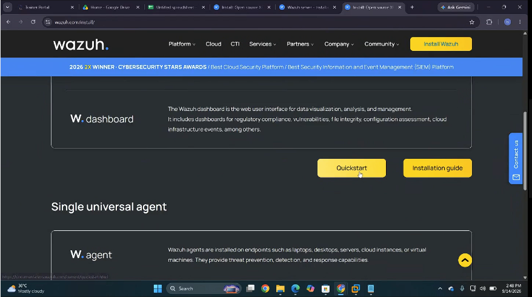

**Step 2 - Review Quickstart Documentation**

Selected Quickstart from Wazuh's documentation, which provides a single installation-assistant command covering the indexer, manager, Filebeat and dashboard in one step.
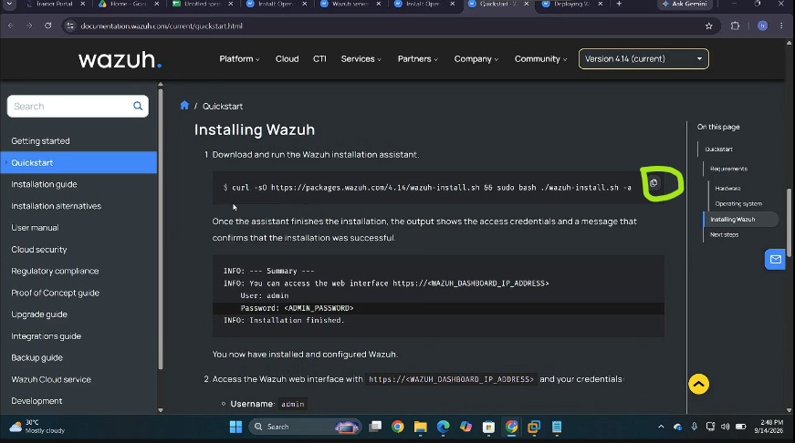

**Step 3 - Run the Installer**

Downloaded and ran the Wazuh installation assistant in the Ubuntu terminal via the **'curl'** command. The installer flagged that the current system (outside the officially recommended list) might not work perfectly, but proceeded regardless, a good reminder that "recommended" isn't the same as "required." The installer then generated certificates for the root CA, admin, indexer, Filebeat, and dashboard, and installed and started each service in sequence.
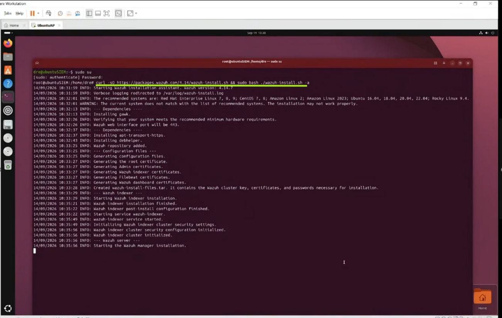

**Step 4 - Log Into the Dashboard**

Installation completed successfully, producing Wazuh credentials. Used these credentials from the Ubuntu terminal to log into the Wazuh dashboard.
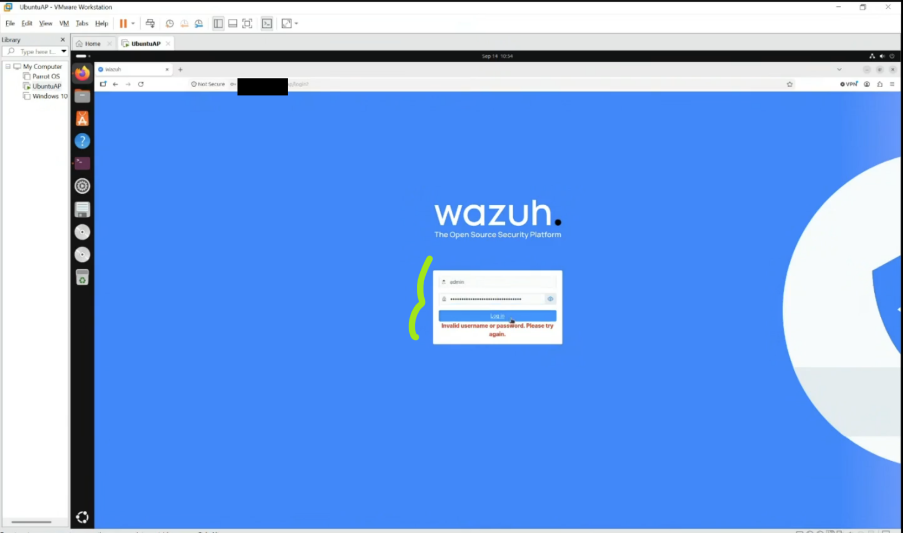

**Step 5 - Resolve a Login Error**

Hit an "Invalid username or password" error on the first login attempt. Diagnosed the issue by re-checking the credentials generated during installation and logged in successfully on retry.
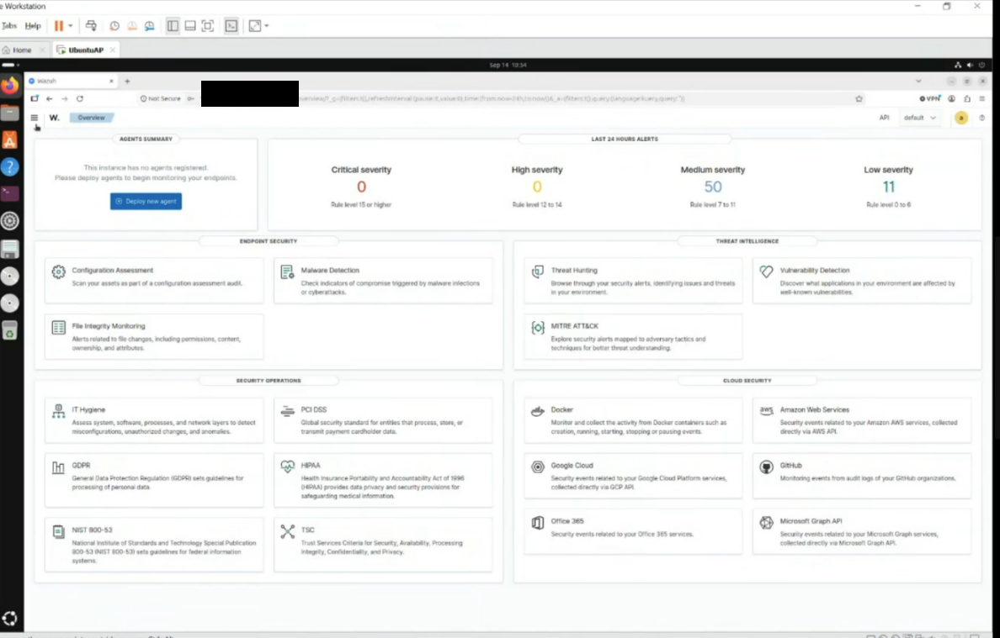

Lab 1 complete ✅

--------------------------------------------------------------------------------------------------------------------------------------------------------------------------------------------

## Lab 2 - Windows Agent Deployment

**Objective**: Deploy a Wazuh agent to a Windows 10 VM so it can be monitored as an endpoint.

**Step 1 - Open the Deploy New Agent Wizard**
With Wazuh successfully launched, clicked the **"Deploy new agent"** button.
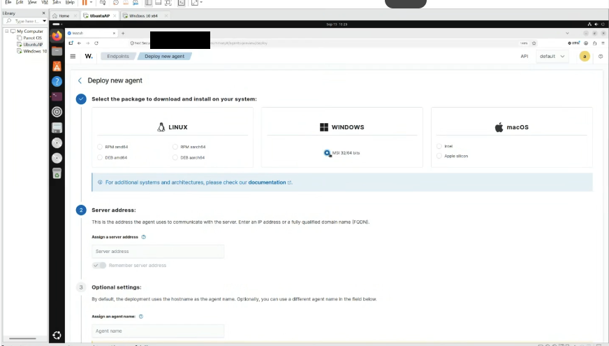

**Step 2 - Select the Windows Package**

Under "Select the package to download and install on your system," selected the Windows option. In the "Assign an agent name" box, set the name to `windows-agent`, since this is a Windows 10 VM. Then entered the Wazuh server address in the "Assign a server address" box.

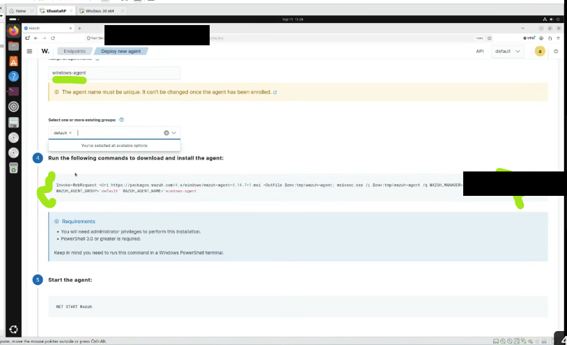

**Step 3 - Run the Generated Command**

Copied the generated `Invoke-WebRequest` command into the PowerShell terminal on the Windows 10 VM and successfully installed the agent.
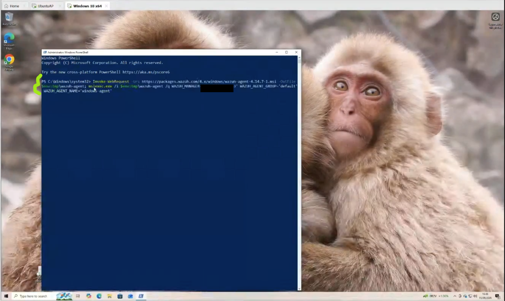

**Step 4 - Start the Wazuh Service**
Ran `NET START wazuh` in the PowerShell terminal 
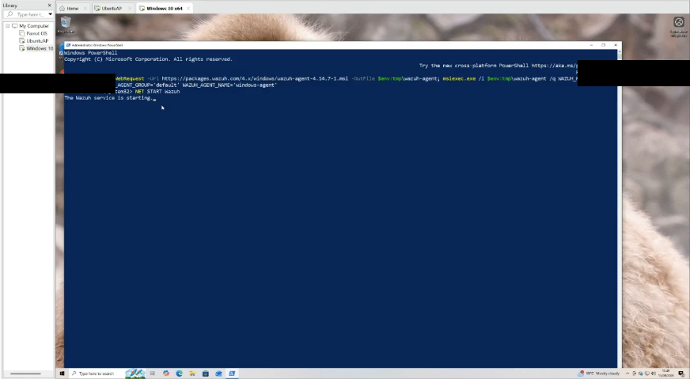

the Wazuh service started successfully.
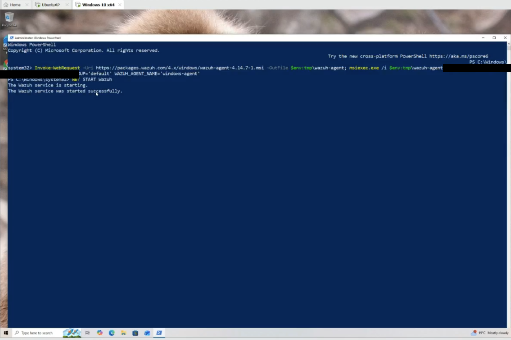

**Step 5 - Verify via Dashboard**

Verified success by browsing to `https://<ip-address>:443`, confirming an **Active** Windows service on the dashboard.
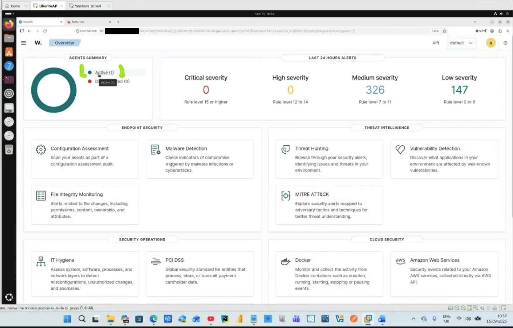

**Step 6 - Deliberately Stop the Service**

Returned to the Windows VM and ran `NET STOP wazuh` to deliberately stop the agent service 
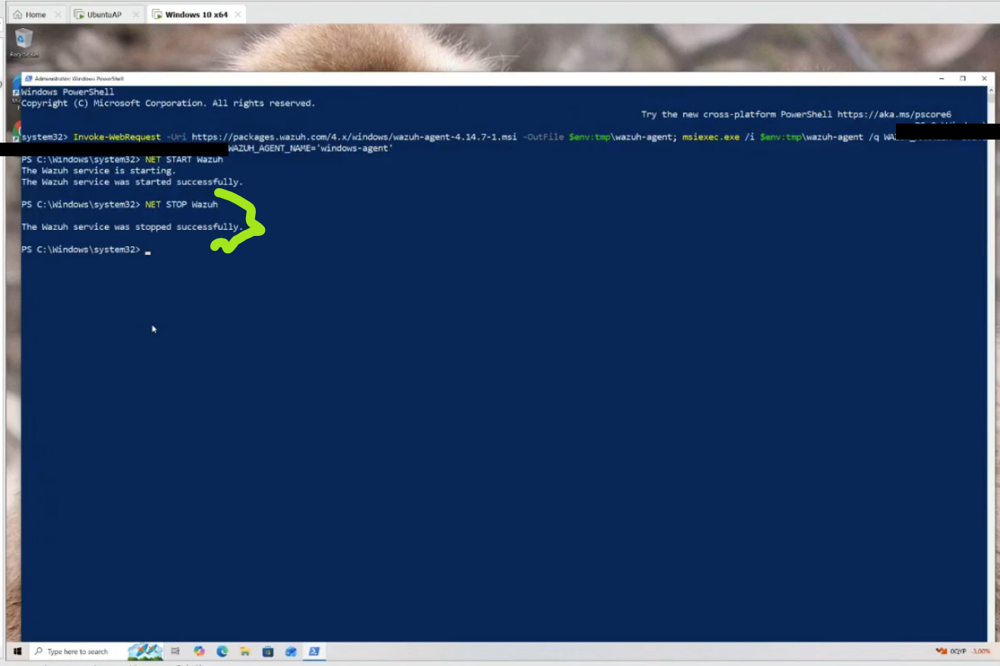

then confirmed on the dashboard that the agent had successfully disconnected.
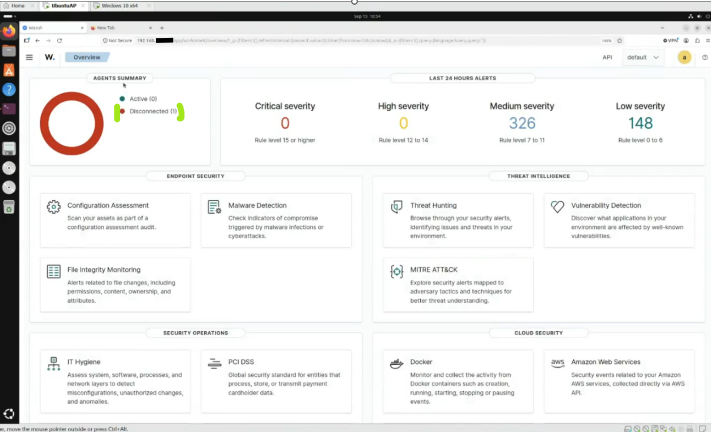

Lab 2 complete ✅

--------------------------------------------------------------------------------------------------------------------------------------------------------------------------------------------

## Lab 3 - Generating Windows Authentication Failure Logs

**Objective**: Deliberately generate real failed-login events so there's genuine data to detect, rather than relying on synthetic test data.

**Step 1 - Restart the Wazuh Service**

Opened a PowerShell terminal on the Windows 10 VM and ran `NET START wazuh` to ensure the service was running ahead of testing.
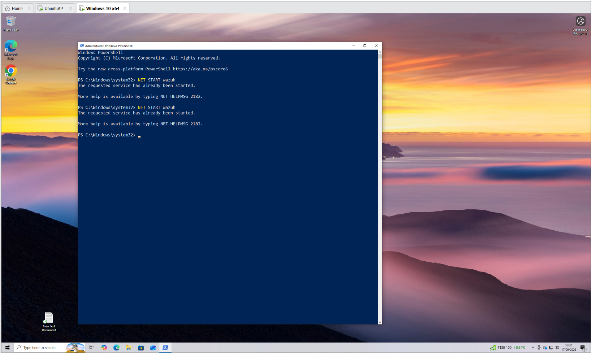

**Step 2 - Confirm Agent Status**

Returned to the Wazuh dashboard and confirmed the Windows agent showed as **Active** before proceeding.
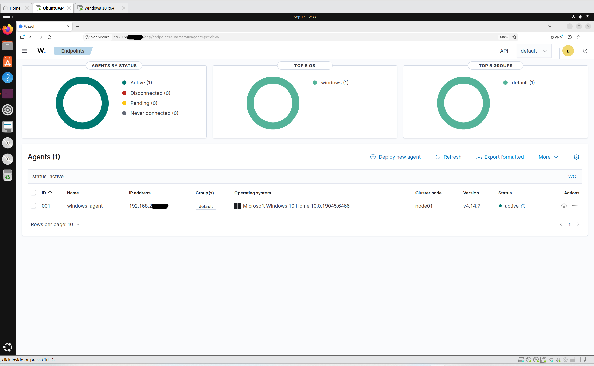

**Step 3 - Generate Real Authentication Failures**

Restarted the Windows VM and deliberately entered the wrong password several times at the lock screen, generating genuine "incorrect PIN/password" authentication failure events.
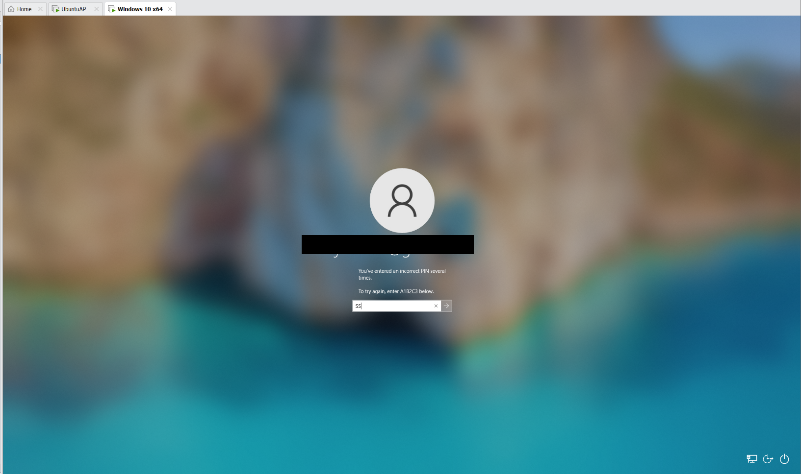

Lab 3 complete ✅

--------------------------------------------------------------------------------------------------------------------------------------------------------------------------------------------

## Lab 4 - Threat Hunting & MITRE ATT&CK Mapping

**Objective**: Confirm the deliberately-generated failures were detected, then identify the specific MITRE ATT&CK technique they represent.

**Step 1 - Review the Overview Dashboard**

Reviewed the Wazuh Overview dashboard, surfacing the full range of available modules: Threat Hunting, MITRE ATT&CK, Vulnerability Detection, File Integrity Monitoring, PCI DSS and others.

Found 4 Authentication Failure logs, circled in green, on the Threat Hunting dashboard.
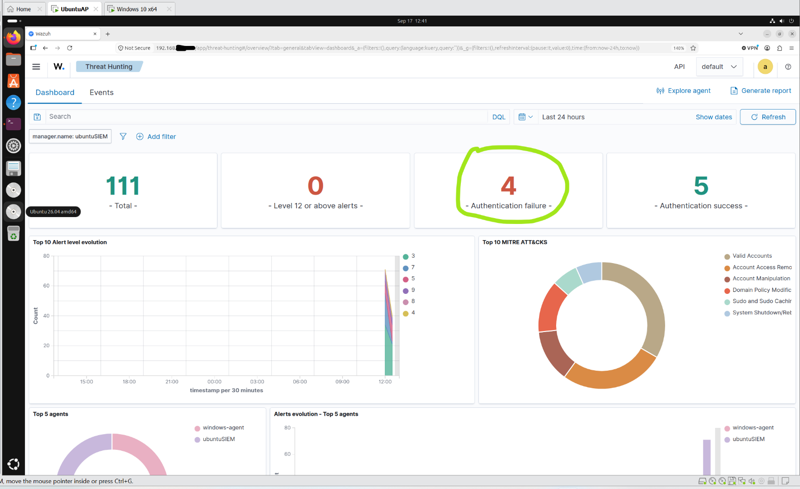

**Step 2 - Inspect the Underlying Events**

Clicked the Events tab and confirmed the underlying evidence: `windows-agent` Logon Failure logs, matching the deliberately-generated failed login attempts from Lab 3.

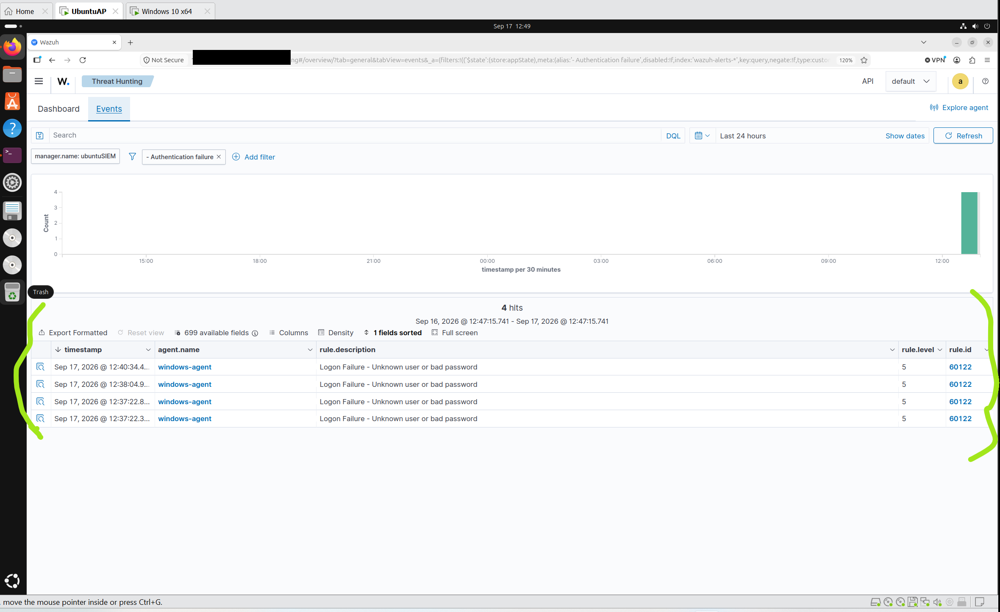

**Step 3 — Map Against MITRE ATT&CK**

Clicked the MITRE ATT&CK dashboard and mapped the `windows-agent` Logon Failure event against the MITRE ATT&CK framework, identifying it under the **Impact** tactic with technique ID **T1531**.
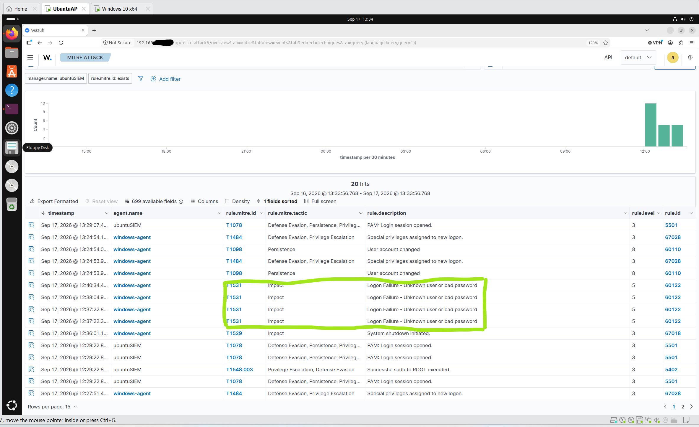

**Step 5 - Identify the Technique**
Clicked the T1531 ID to bring up its full name and description: **Account Access Removal**. Per MITRE's own description, this covers adversaries interrupting availability of system and network resources by inhibiting access to accounts used by legitimate users - accounts may be deleted, locked, or manipulated to remove access.
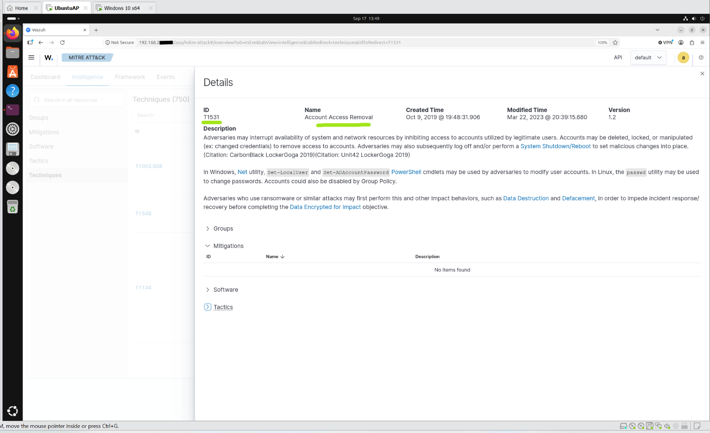

Lab 4 complete ✅

--------------------------------------------------------------------------------------------------------------------------------------------------------------------------------------------

## Resources Created - Summary

|        **Resource**         |              **Name **                              |                           Purpose                                             |                                 
|-----------------------------|-----------------------------------------------------|-------------------------------------------------------------------------------|
|     **Wazuh Server**        |        Ubuntu VM (hostname: ubuntuSIEM)             |                     Manager, indexer and dashboard                            |
|                             |                                                     |                                                                               |
|      **Wazuh Agent**        |               windows-agent                         |                      Monitored Windows 10 endpoint                            |
|                             |                                                     |                                                                               |
|     **Detection Rule**      |               Rule ID 60122                         |             Logon Failure - Unknown user or bad password                      |
|                             |                                                     |                                                                               |
|    **MITRE ATT&CK Mappin**  |                  T1531                              |   Identifies the specific adversary technique behind the detected failures    |
|                             |                                                     |                                                                               |
|    **Dashboard View**       |  Threat Hunting → Events (filtered by manager.name) |                  Confirms end-to-end detection pipeline                       |

